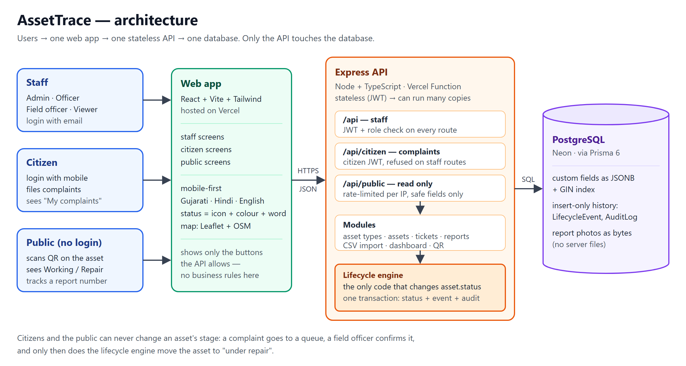

# AssetTrace

**Track and manage any public infrastructure asset across its entire lifecycle — from planning to disposal.**

Built for the Pravi Research "Build for Billions" hackathon.

🔗 Live app: `<vercel-url>` · API: `<render-url>` (health: `<render-url>/health`)

---

## The problem

Government departments own thousands of assets — streetlights, water pumps, transformers, buildings. Registers are often spreadsheets or paper, so nobody knows reliably what exists, where it is, what condition it's in, when it was last serviced, or when it needs replacing. Citizens who notice a broken asset have no simple way to report it.

## What AssetTrace does

- **Any asset type:** admins define new asset types and their fields — no code change needed.
- **Full lifecycle:** Planned → Acquired → Commissioned → In operation ⇄ Under maintenance → Decommissioned → Disposed, with invalid moves blocked.
- **Complete history:** every change records who, when and why (insert-only).
- **Maintenance:** preventive schedules, corrective tickets, overdue alerts.
- **QR on every asset:** scan to open the asset page.
- **Citizen reporting:** anyone can report a problem in Gujarati, Hindi or English without typing; staff confirm or reject; citizens track progress with a number.
- **Dashboard and map:** health at a glance, assets on a map.
- **Bulk import:** upload existing Excel/CSV registers.
- **Built for Bharat:** one inclusive, mobile-first UI — icon + colour + word for every status, plain language, big touch targets, works on slow networks.

## Screenshots

| Dashboard | Asset detail | Public report (mobile) |
|---|---|---|
| `docs/screens/dashboard.png` | `docs/screens/asset.png` | `docs/screens/public.png` |

## Architecture



- React (Vite) frontend → Express API (Node + TypeScript, stateless) → PostgreSQL
- Lifecycle engine is the only code path that changes an asset's status
- Separate, rate-limited public API that can only read safe fields and file reports

Full details: [docs/ARCHITECTURE.md](docs/ARCHITECTURE.md) · Design decisions: [docs/DECISIONS.md](docs/DECISIONS.md)

## Scale proof

See [docs/PERFORMANCE.md](docs/PERFORMANCE.md) for the 100k-asset benchmark and [docs/USABILITY.md](docs/USABILITY.md) for the accessibility checklist.

## Tech stack

| Layer | Technology |
|---|---|
| Frontend | React, Vite, TypeScript, Tailwind, react-i18next, react-leaflet, Recharts |
| Backend | Node.js, Express, TypeScript, zod, JWT, bcryptjs, multer, csv-parse, qrcode |
| Database | PostgreSQL, Prisma (JSONB + GIN index) |
| Deployment | Vercel (web), Render (API + Postgres) |

## Run locally

```bash
git clone <repo-url> && cd assettrace
docker compose up -d                      # Postgres 16 (needs Docker Desktop)

cd api
cp .env.example .env
npm install
npx prisma migrate dev
npx prisma db seed                        # SEED_ASSET_COUNT=5000 by default
npm run dev                               # http://localhost:4000

cd ../web
cp .env.example .env
npm install
npm run dev                               # http://localhost:5173
```

**Demo logins** (password `demo1234`): `admin@demo.in` · `officer@demo.in` · `viewer@demo.in`
**Public view:** open `/` or any `/a/<assetCode>` — no login.

## API overview

| Area | Endpoints |
|---|---|
| Auth | `POST /api/auth/login`, `GET /api/auth/me` |
| Asset types | `GET/POST /api/asset-types`, `GET/PATCH /api/asset-types/:id` |
| Assets | `GET/POST /api/assets`, `GET/PATCH /api/assets/:id`, `GET /api/assets/map` |
| Lifecycle | `POST /api/assets/:id/transition`, `GET /api/assets/:id/timeline` |
| QR | `GET /api/assets/:id/qr` |
| Maintenance | `GET/POST /api/tickets`, `PATCH /api/tickets/:id`, `POST /api/tickets/:id/close` |
| Reports (staff) | `GET /api/reports`, `POST /api/reports/:id/confirm`, `POST /api/reports/:id/reject` |
| Import | `POST /api/imports`, `GET /api/imports/:id` |
| Dashboard | `GET /api/dashboard/summary` |
| Tickets (preventive) | `POST /api/tickets/service` (log a service) |
| Public | `GET /api/public/assets/:code`, `GET /api/public/assets/nearby`, `POST /api/public/reports`, `GET /api/public/reports/:trackingCode` |

## Performance

Measured on 100,000 assets — see [docs/PERFORMANCE.md](docs/PERFORMANCE.md).

| Query | Without index | With index |
|---|---|---|
| Filter by stage + type (page 1) | 12.1 ms (Seq Scan) | 0.13 ms (Index Scan) |
| Overdue maintenance | 13.8 ms (Seq Scan) | 0.09 ms (Index Scan) |
| Search custom field (JSONB) | 18.9 ms (Seq Scan) | 4.3 ms (GIN Bitmap Scan) |

## Known limitations

- No interactive API docs (cut for time); endpoints are listed above and every error has the shape `{ error: { code, message, details? } }`.
- CSV import runs synchronously (streamed, batches of 500); very large files keep one request open.

- Free hosting: the API sleeps after inactivity (first request takes ~1 minute).
- Photos are stored in the database (object storage in production).
- Bulk imports run in-process (job queue in production).
- One shared lifecycle for all asset types (per-type lifecycles are future scope).
- Gujarati/Hindi translations: drafted without a native speaker; **needs review** (see `_TODO` in `web/src/i18n/gu.json`, `hi.json`).

## Future scope

Load balancer + multiple API instances, Redis caching, read replicas, history table partitioning, PostGIS, object storage, OTP-verified reporting, per-type custom lifecycles, offline field app, SMS/WhatsApp status updates, department/state multi-tenancy.

## How we used AI

We used Claude Code as a coding assistant, working step by step from a written plan (`CLAUDE.md`, `docs/PROMPTS.md`). We designed the problem framing, architecture, data model, lifecycle rules and UI principles, reviewed and tested every step, and recorded each step in [docs/TASKS.md](docs/TASKS.md). Design decisions and their trade-offs are in [docs/DECISIONS.md](docs/DECISIONS.md). Claude Code wrote most of the code, one numbered step at a time (P0–P22), and ran each step (unit tests, curl scripts for every endpoint, headless-Chrome screenshots at 360 px) before committing. Human decisions made at kickoff (P0) and recorded in DECISIONS.md: pinning Prisma 6, the ticket guards on the lifecycle, the `details` field in errors, allowing CSV imports with a status. Scope cuts made under time pressure: interactive API docs and background import polling. What we would do differently: native-speaker translation from the start, and a real device test earlier.

## Team

`<names, roles>`
