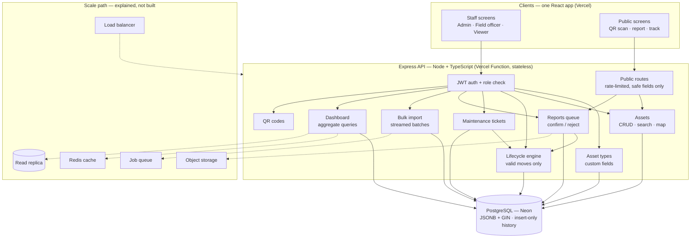
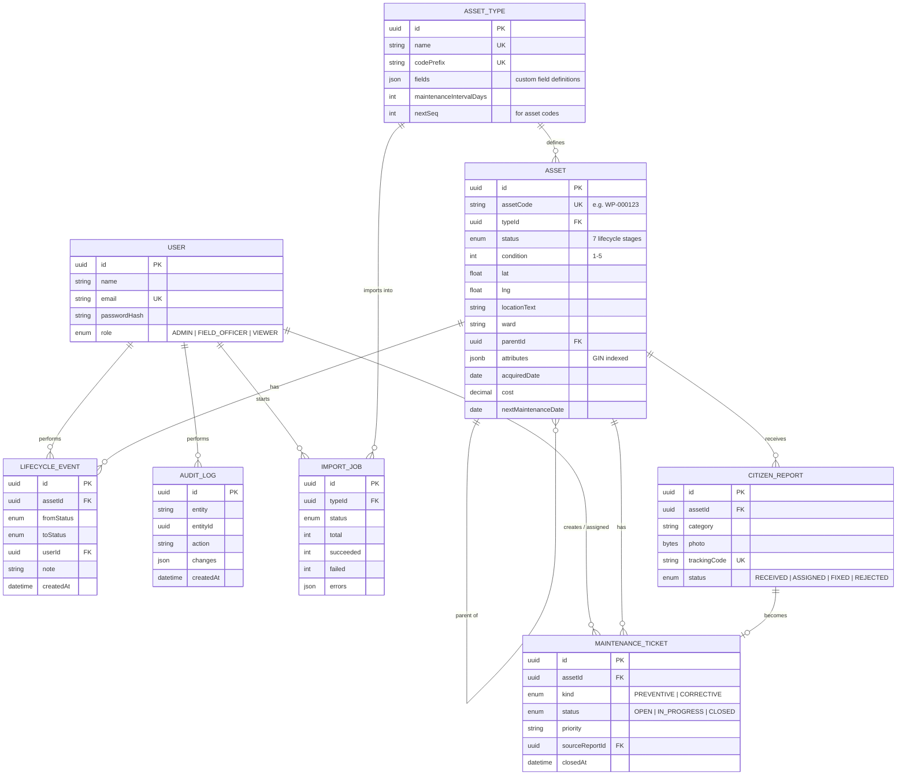
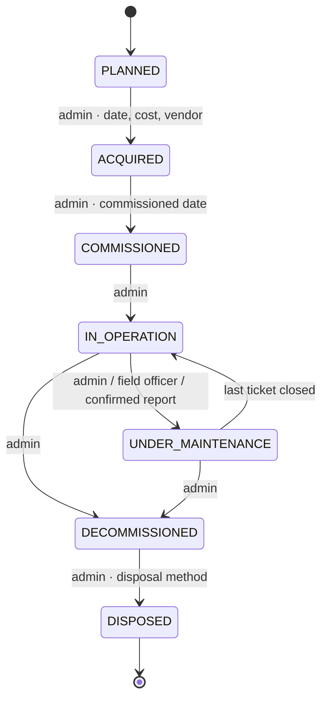
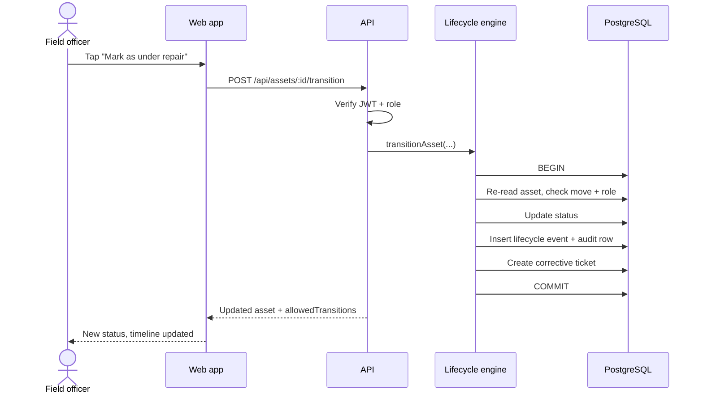
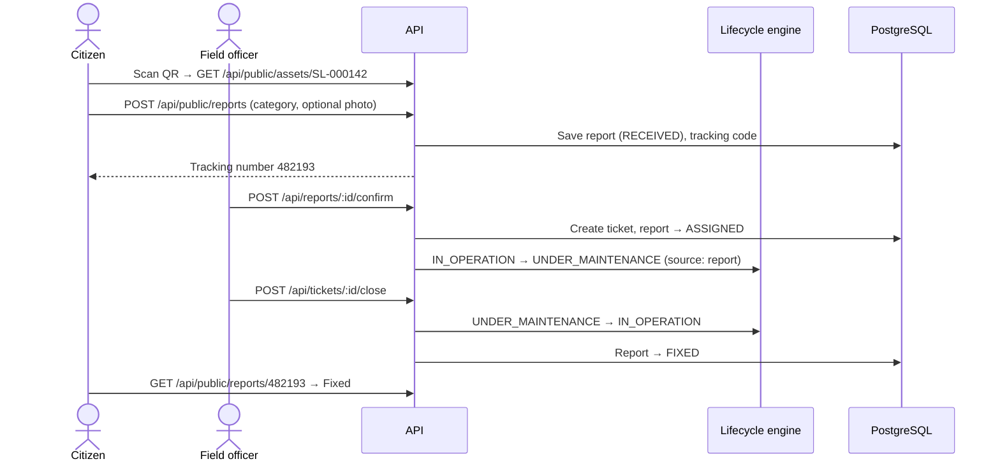
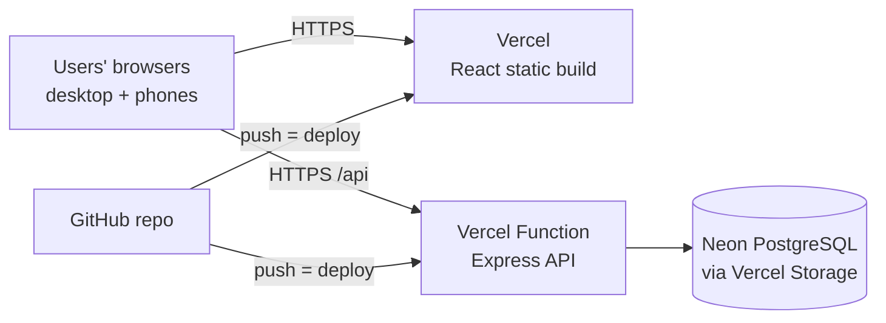

# ARCHITECTURE.md — AssetTrace

All diagrams are Mermaid. Paste any block into https://mermaid.live to export a PNG for slides or the README.

## 1. System overview

**Key rules**
- Clients only talk to the API; only the API touches the database.
- Only the lifecycle engine changes `asset.status`. The reports queue and maintenance module call it instead of updating status themselves.
- The API is stateless (JWT), so it scales horizontally behind a load balancer.

## 2. Database (ERD)

**Indexes:** `Asset(typeId)`, `Asset(status)`, `Asset(ward)`, `Asset(nextMaintenanceDate)`, `Asset(parentId)`, `Asset(lat, lng)`, GIN on `Asset(attributes)`, `LifecycleEvent(assetId, createdAt)`, `MaintenanceTicket(assetId, status)`, `CitizenReport(status)`, `AuditLog(entity, entityId)`.

## 3. Lifecycle state machine

Public view maps these to 3 states: `IN_OPERATION → Working`, `UNDER_MAINTENANCE → Being repaired`, everything else → `Not in service`.

## 4. Key flows

### 4.1 Staff changes an asset's stage

### 4.2 Public report → repair → fixed

## 5. Deployment

Notes: HTTPS is required for phone GPS and camera. The API runs as one Vercel Function (zero-config Express); request bodies are capped at 4.5 MB by Vercel. Neon's free database may pause when idle; the first query after a pause takes a second or two. QR codes are generated from `FRONTEND_URL`, so they must point to the Vercel domain.

## 6. Scaling plan

| Pressure | What breaks first | Fix |
|---|---|---|
| More users | Single API instance | Stateless API → more instances behind a load balancer |
| Dashboard load | Repeated aggregate queries | Cache in Redis / materialized views refreshed every minute; read replica for reads |
| 10M+ assets | Unindexed filters | Already indexed; add composite indexes from real query patterns; PostGIS for spatial queries |
| History growth | `LifecycleEvent`, `AuditLog` tables | Partition by month, archive old partitions |
| Large imports | Single-thread CPU, restarts mid-job | Job queue (BullMQ + Redis) with workers and retries |
| Photos | Database size | Object storage (S3-compatible), store URL only |
| Spam reports | Report queue noise | OTP verification, per-device limits, duplicate detection per asset |
| Multi-state rollout | One shared database | Tenant id per department/state, row-level security |
